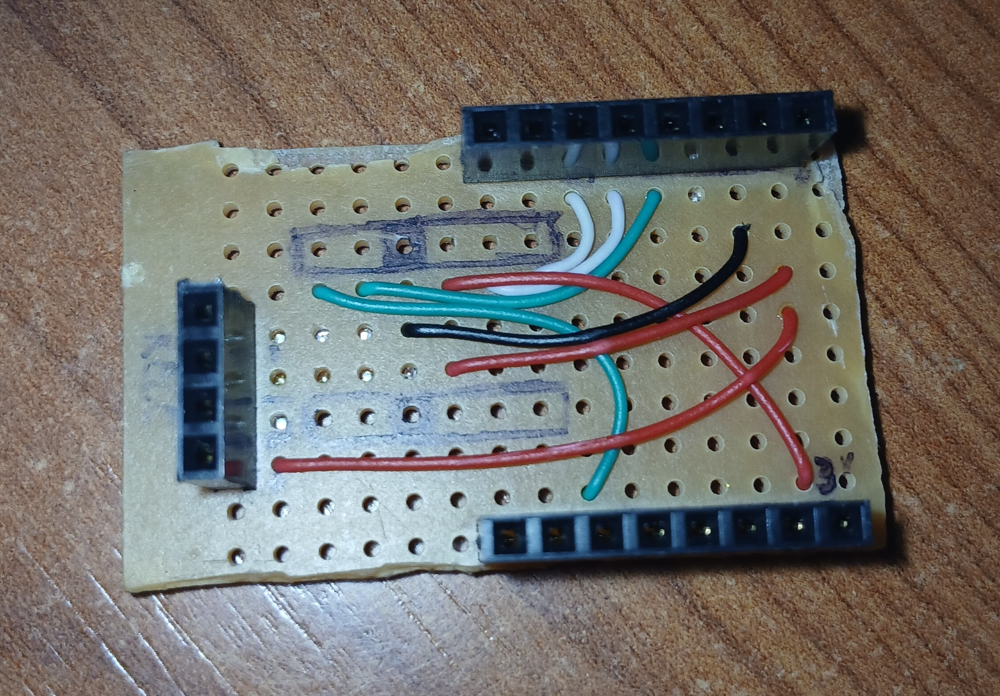
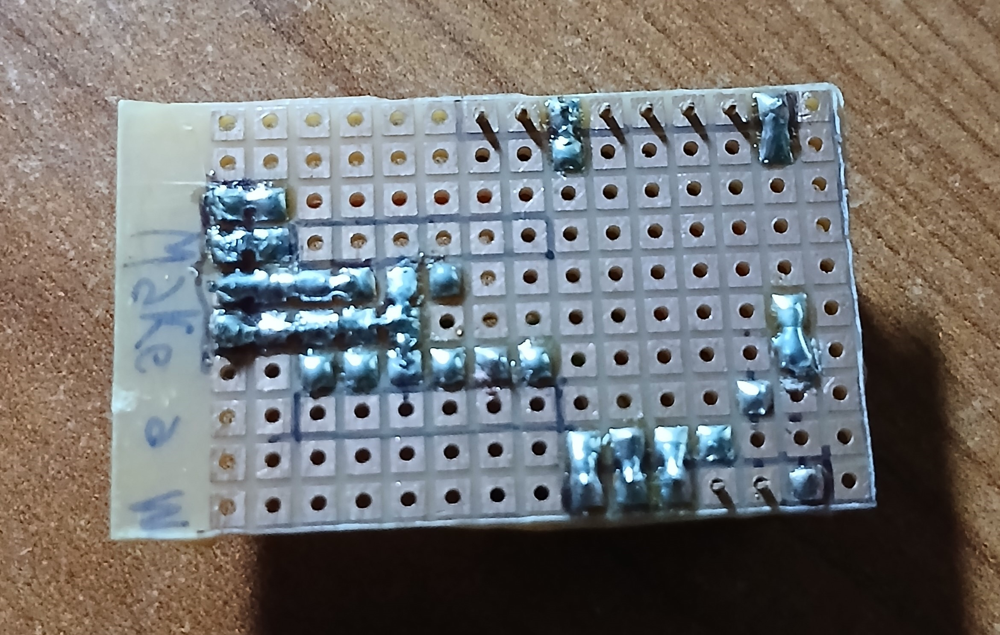
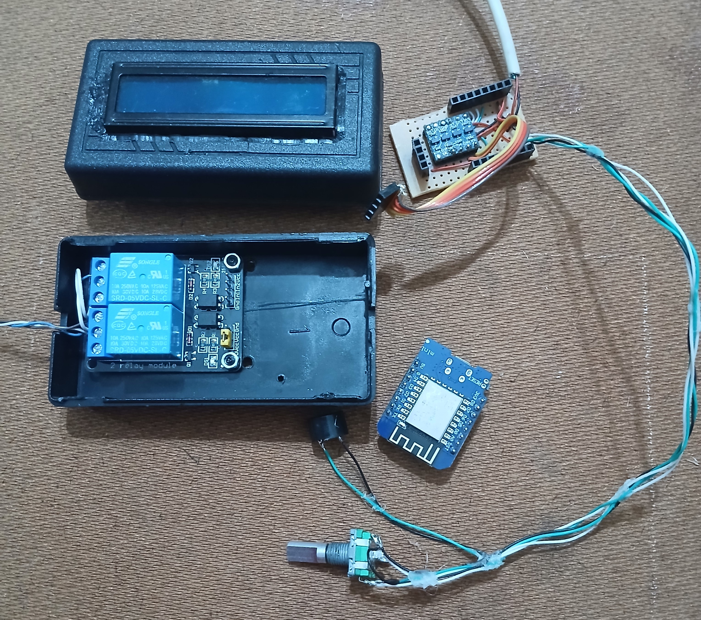
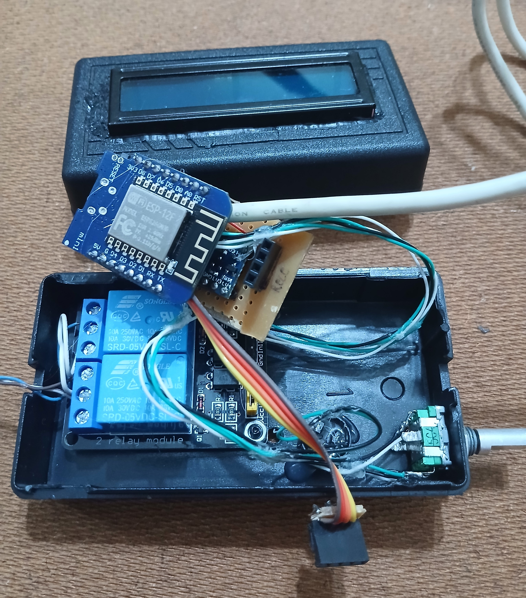
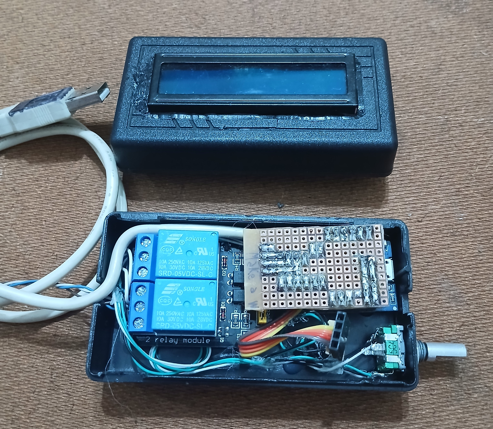
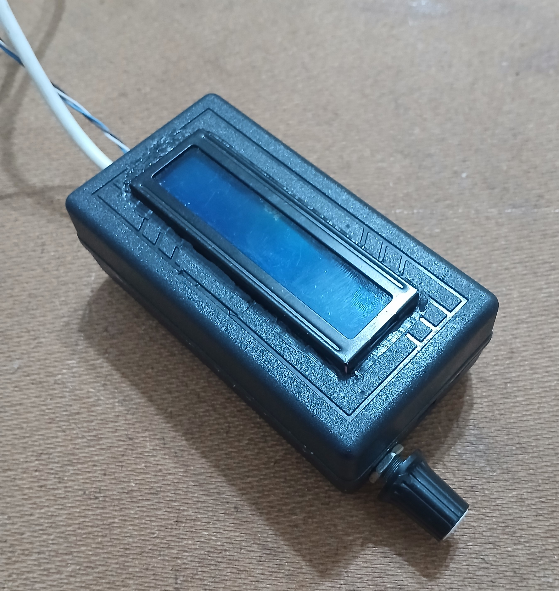
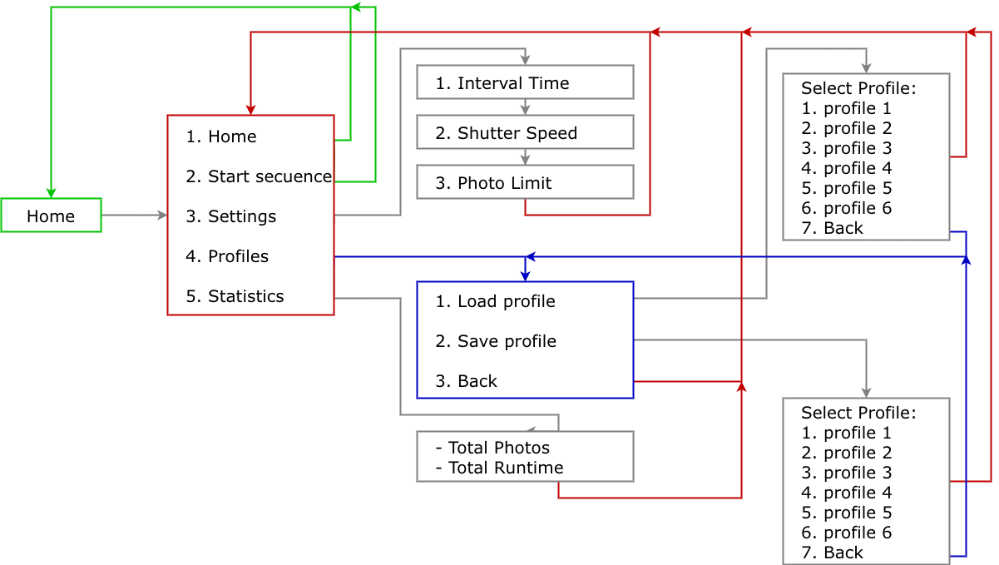

# AstroPhotographer

*Read this in other languages: [Español](README_es.md)*

**AstroPhotographer** is an advanced, automated intervalometer specifically designed for astrophotography. Based on the ESP8266 microcontroller, this device allows precise control of the shutter and focus of DSLR or Mirrorless cameras through a relay system, providing comprehensive management for long photographic sessions.

## Main Features

* **Precise Control:** Management of shutter speeds and intervals between photos via a 2-channel relay module.
* **Profile Management:** Non-volatile storage of up to 6 customizable shooting profiles (name, shutter speed, interval, and photo limit).
* **Intuitive User Interface:** Menu navigation using a rotary encoder and real-time visualization on a 16x2 LCD display (I2C).
* **Global Statistics:** Persistent recording in EEPROM memory (LittleFS/Preferences) of the total historical photos captured and the total running time of the device.
* **Acoustic Notifications:** Integration of an active buzzer for sequence completion alerts.
* **Adaptive Logic:** Software compensation for native reverse logic found in standard relay modules, and hardware/software managed debounce for the rotary encoder.

---

## Hardware Requirements

* ESP8266 Microcontroller (NodeMCU V2/V3 or Wemos D1 Mini).
* 16x2 LCD Display with I2C adapter module.
* Rotary Encoder (Standard 5-pin module or "bare" encoder with internal Pull-Up resistors enabled via software).
* 2-Channel Relay Module (Reverse Logic in this specific build).
* Active Buzzer.
* Camera trigger cable compatible with your specific camera port.
* Logic Level Shifter (3.3V to 5V).

---

## Wiring Schematic (Pinout)

### Hardware Wiring Diagram

### Canon camera jack connection

The following table describes the connection of the peripherals to the ESP8266 GPIO pins according to the firmware configuration:

| Component | Component Pin | ESP8266 Pin |
| :--- | :--- | :--- |
| **LCD Display (I2C)** | SCL | D1 |
| | SDA | D2 |
| **Camera Relays** | Focus IN | D0 |
| | Shutter IN | D3 |
| **Rotary Encoder** | Pin A (DT) | D5 |
| | Pin B (CLK) | D6 |
| | Switch (SW) | D7 |
| **Buzzer**| Positive (VCC/IN) | D8 |

> **Note:** Ensure proper power supply (VCC 3.3V/5V and GND) to the LCD, rotary encoder, and relay module using the board's power outputs or an external regulated power source.

### Hardware assembly
My hardware assembly
| **Perfboard (Top View)** | **Perfboard (Soldering)** | **Case Mounting (1)** |
| :---: | :---: | :---: |
|  |  |  |
| **Case Mounting (2)** | **Case Mounting (3)** | **Final Assembly** |
|  |  |  |

> **Author's note:** I know, this is a bit of a mess; I'm working on a future version that uses Bluetooth instead of a display. Any help is welcome.
---

## Software Dependencies & Libraries

To compile this project in the Arduino IDE, you must install the ESP8266 board support and the following libraries:

1. **[LiquidCrystal_I2C](https://github.com/markub3327/LiquidCrystal_I2C)** (v2.0.0) by Martin Kubovčík / Frank de Brabander: For display management.
2. **[Ai Esp32 Rotary Encoder](https://github.com/igorantolic/ai-esp32-rotary-encoder)** (v1.7) by Igor Antolic: For asynchronous reading and hardware acceleration of the encoder. *(Note: Fully compatible with ESP8266 despite its name).*
3. **[Preferences](https://github.com/vshymanskyy/Preferences)** (v2.2.2) by Volodymyr Shymanskyy: Used to emulate secure EEPROM writing via the LittleFS file system.

---

## Menu Flowchart

---

## Usage and Navigation

The system is operated entirely through the rotary encoder (Rotate to navigate/adjust, Press to select).

* **Main Menu:** Access to start sequence, manual configuration, profile loading/saving, and statistics visualization.
* **Start Sequence:** Allows forcing the focus (clockwise rotation) or taking a test shot (counter-clockwise rotation) before starting automation. During the session, the display shows a progress bar and elapsed time.
* **Configuration:** Real-time adjustment of shutter time, interval between photos, and capture limit (0 = infinite).
* **Profiles:** The system allows editing each profile's name character by character for easy identification of photographic setups (e.g., "Milky Way", "Startrails").

---

## Installation

### 1. Board Manager Setup
If you haven't already, add the ESP8266 board support to your Arduino IDE:
* Go to **File > Preferences**.
* In "Additional Boards Manager URLs", add: `https://arduino.esp8266.com/stable/package_esp8266com_index.json`
* Go to **Tools > Board > Boards Manager**, search for `esp8266` and install it.

### 2. Flashing the Firmware
1. Clone this repository.
2. Open the main file `Astrophotographer.ino` in the Arduino IDE.
3. Install the libraries mentioned in the dependencies section via the Library Manager (`Ctrl+Shift+I`).
4. Select your specific ESP8266 board in **Tools > Board**.
5. Compile and upload the firmware to the microcontroller.

---

## License

This project is licensed under the [GNU General Public License v3.0](LICENSE) - see the LICENSE file for details.
