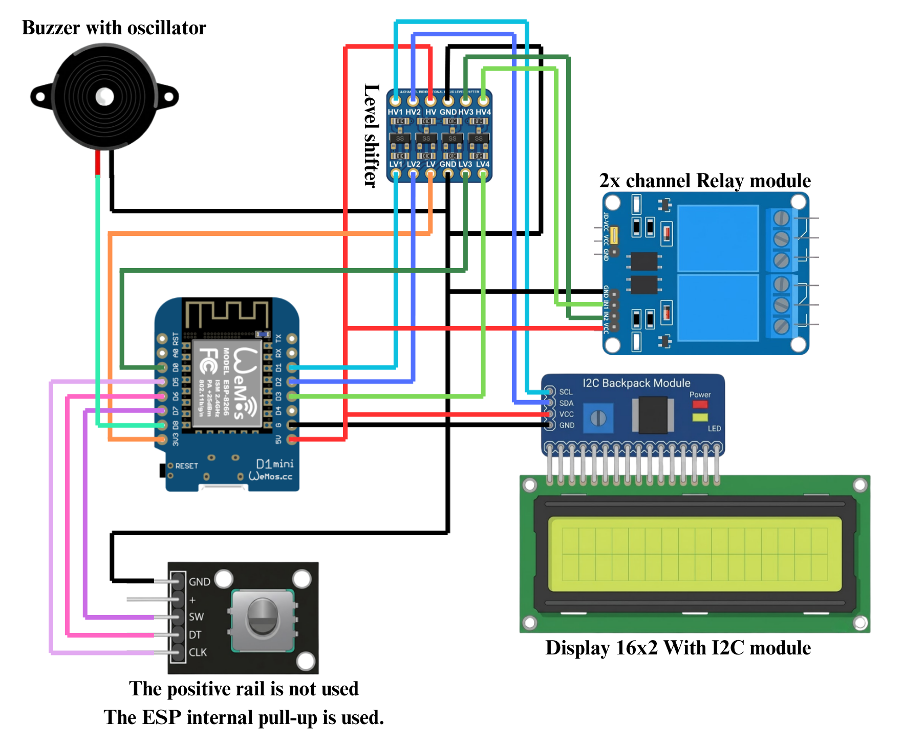
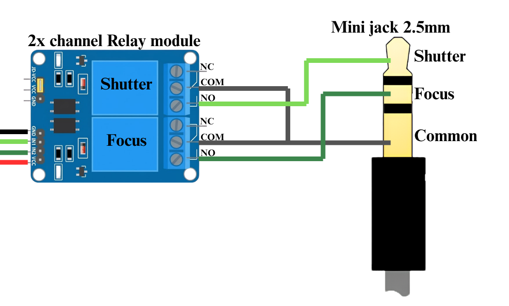
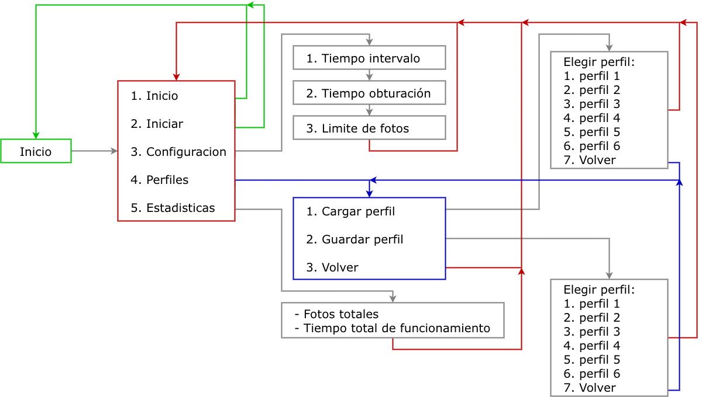

# AstroPhotographer 

*Leer esto en otros idiomas: [English](README.md)*

**AstroPhotographer** es un intervalómetro avanzado y automatizado diseñado específicamente para la astrofotografía. Basado en el microcontrolador ESP8266, este dispositivo permite el control preciso del obturador y el enfoque de cámaras DSLR o Mirrorless mediante un sistema de relés, ofreciendo una gestión integral de sesiones fotográficas largas.

## Características Principales

* **Control Preciso:** Gestión de tiempos de obturación e intervalos entre fotos a través de un módulo de relés de 2 canales.
* **Gestión de Perfiles:** Almacenamiento no volátil de hasta 6 perfiles de disparo personalizables (nombre, tiempo de obturación, intervalo y límite de fotografías).
* **Interfaz de Usuario Intuitiva:** Navegación por menús mediante un encoder rotativo y visualización en tiempo real a través de una pantalla LCD 16x2 (I2C).
* **Estadísticas Globales:** Registro persistente en memoria EEPROM (LittleFS/Preferences) del total histórico de fotografías capturadas y el tiempo total de funcionamiento del equipo.
* **Notificaciones Acústicas:** Integración de un buzzer activo para alertas de finalización de secuencia.
* **Lógica Adaptativa:** Compensación por software para la lógica inversa nativa de los módulos de relés estándar, y filtrado de rebotes (debounce) por hardware/software para el encoder rotativo.

---

## Hardware Requerido

* Microcontrolador ESP8266 (NodeMCU V2/V3 o Wemos D1 Mini).
* Pantalla LCD 16x2 con módulo adaptador I2C.
* Encoder Rotativo (módulo estándar de 5 pines o encoder "pelado" con resistencias Pull-Up internas activadas por software).
* Módulo de Relés de 2 Canales (Lógica Inversa).
* Buzzer Activo.
* Conversor de Nivel Lógico (Logic Level Shifter de 3.3V a 5V).
* Cable disparador compatible con el puerto de la cámara fotográfica a utilizar.

---

## Esquema de Conexiones (Pinout)

### Diagrama de Conexiones Hardware

### Conexion del Jack 2.5 (para camara Canon)

La siguiente tabla describe la conexión de los periféricos a los pines GPIO del ESP8266 según la configuración del firmware:

| Componente | Pin del Componente | Pin ESP8266 |
| :--- | :--- | :--- |
| **Pantalla LCD (I2C)** | SCL | D1 |
| | SDA | D2 |
| **Relés de Cámara** | Foco (Focus) IN | D0 |
| | Obturador (Shutter) IN | D3 |
| **Encoder Rotativo** | Pin A (DT) | D5 |
| | Pin B (CLK) | D6 |
| | Switch (SW) | D7 |
| **Buzzer**| Positivo (VCC/IN) | D8 |

> **Nota:** Asegúrese de proveer la alimentación adecuada (VCC 3.3V/5V y GND) a la pantalla LCD, al encoder rotativo y al módulo de relés utilizando las salidas de alimentación de la placa o una fuente externa regulada.

> **Nota del autor:** Lo se, esto es un lio, estoy trabajando en una proxima version sin display usando bluetooth, cualquier ayuda es bien recibida.
---

## Dependencias y Librerías de Software

Para compilar este proyecto en el Arduino IDE, es necesario tener instalado el soporte para placas ESP8266 y las siguientes librerías:

1. **[LiquidCrystal_I2C](https://github.com/markub3327/LiquidCrystal_I2C)** (v2.0.0) por Martin Kubovčík / Frank de Brabander: Para la gestión de la pantalla.
2. **[Ai Esp32 Rotary Encoder](https://github.com/igorantolic/ai-esp32-rotary-encoder)** (v1.7) por Igor Antolic: Para la lectura asíncrona y aceleración de hardware del encoder. *(Nota: Es totalmente compatible con el ESP8266 a pesar de su nombre).*
3. **[Preferences](https://github.com/vshymanskyy/Preferences)** (v2.2.2) por Volodymyr Shymanskyy: Utilizada para emular la escritura segura en EEPROM a través del sistema de archivos LittleFS.

---

## Diagrama de Flujo del Menú

*(Inserta aquí tu imagen de KiCad o tu diagrama de flujo para visualizar la navegación del menú)*

---

## Uso y Navegación

El sistema se opera enteramente a través del encoder rotativo (Girar para navegar/ajustar, Presionar para seleccionar).

* **Menú Principal:** Acceso al inicio de secuencia, configuración manual, carga/guardado de perfiles y visualización de estadísticas.
* **Inicio de Secuencia:** Permite forzar el enfoque (giro en sentido horario) o tomar una fotografía de prueba (giro en sentido antihorario) antes de comenzar la automatización. Durante la sesión, la pantalla muestra una barra de progreso y el tiempo transcurrido.
* **Configuración:** Ajuste en tiempo real del tiempo de obturación, intervalo entre fotos y límite de capturas (0 = infinito).
* **Perfiles:** El sistema permite editar el nombre de cada perfil carácter por carácter para una fácil identificación de los setups fotográficos (ej. "Via Lactea", "Startrails").

---

## Instalación

### 1. Configuración del Gestor de Tarjetas
Si aún no lo ha hecho, agregue el soporte para placas ESP8266 a su Arduino IDE:
* Vaya a **Archivo > Preferencias**.
* En "Gestor de URLs Adicionales de Tarjetas", agregue: `https://arduino.esp8266.com/stable/package_esp8266com_index.json`
* Vaya a **Herramientas > Placa > Gestor de Tarjetas**, busque `esp8266` e instálelo.

### 2. Grabado del Firmware
1. Clone este repositorio.
2. Abra el archivo principal `Astrophotographer.ino` en el Arduino IDE.
3. Instale las librerías mencionadas en la sección de dependencias a través del Gestor de Librerías (`Ctrl+Shift+I`).
4. Seleccione su placa ESP8266 específica en **Herramientas > Placa**.
5. Compile y suba el firmware al microcontrolador.

---

## Licencia

Este proyecto está bajo la Licencia [GNU General Public License v3.0](LICENSE) - mira el archivo LICENSE para más detalles.
